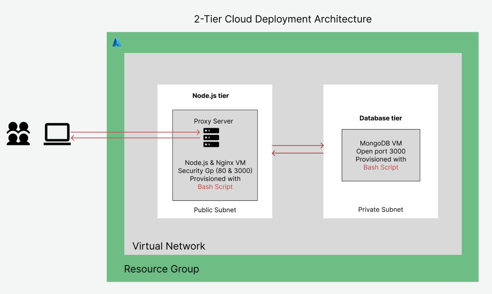

# 2-Tier Deployment Documentation Table of Content

- [1. automate-mongodb-with-script.md](two-tier-automation/1.%20automate-mongodb-with-script.md)
- [2. automate-nodejs-deployment-with-script.md](two-tier-automation/2.%20automate-nodejs-deployment-with-script.md)
- [mongo-provision.sh](two-tier-automation/mongo-provision.sh)
- [nodejs-provision.sh](two-tier-automation/nodejs-provision.sh)
- [vm-for-nodejs-and-mongodb.md](two-tier-automation/vm-for-nodejs-and-mongodb.md)

# Automate the 2-Tier App

- [Automate the 2-Tier App](#automate-the-2-tier-app)
  - [Explanations/steps of how you did it](#explanationssteps-of-how-you-did-it)
  - [How and why you used different levels of automation, from manual, to using Bash scripting, to using user data, to using VM images](#how-and-why-you-used-different-levels-of-automation-from-manual-to-using-bash-scripting-to-using-user-data-to-using-vm-images)
  - [Diagram of the cloud deployment architecture](#diagram-of-the-cloud-deployment-architecture)
  - [Screenshots of different levels of automation working](#screenshots-of-different-levels-of-automation-working)
  - [Blocker](#blocker)

## Explanations/steps of how you did it

- I automated the 2-tier application deployment on Azure using two virtual machines within the same Resource Group: one for the Node.js frontend (public subnet) and one for MongoDB (private subnet).
- I opened ports 80 to give internet access and 3000 for database access on the frontend Node.js virtual machine.
- I used user data scripts when creating the virtual machine to automate provisioning.
- On the frontend virtual machine, the script installed Nginx, Node.js, and configured a reverse proxy to forward port 80 traffic to the Node.js app running on port 3000.
- I cloned the app from GitHub, installed dependencies using npm install, and used pm2 to manage the Node.js process to ensure it runs in the background and restarts on system reboot.
- I also set environment variables for application configuration.
- On the MongoDB virtual machine, I provisioned installation for MongoDB 7.0.6 and configured it to accept connections from any IP (bindIp: 0.0.0.0).
- This approach streamlined deployment, ensured configuration consistency, and reduced manual setup time.
- I also ensured that the provisioning in both cases are idempotent, to avoid any errors or crashed that may occur due to application conflicts.

## How and why you used different levels of automation, from manual, to using Bash scripting, to using user data, to using VM images

- Manual Setup: After provisioning the VM, I ssh into it and manually installed all the necessary packages. This process involves direct interaction with the server via terminal. It provides deep process understanding but is slow, error-prone, and inconsistent.

- Bash Scripting: In order to speed up the manual process and automate repetitive tasks involved in deploying the two-tier app, I used bash script to automates the deployment process by writing scripts containing command sequences for installing packages and configuring services. It reduces manual effort, improves consistency, and enables easier setup reproduction.

- User Data: Using User data is similar to using bash script to automate the deployment, but the script runs automatically during the VM's first boot. This automates VM setup by executing the script upon creation, eliminating post-deployment manual intervention.

- VM Images: Finally, then I created a fully configured VM and created an image of that VM. The image is then used subsequently for provisioning virtual machines with almost all the applications and configurations needed. These images enable rapid deployment of identical VMs, providing fast and consistent setups across environments.

- Progression Justification: The manual setup provided essential end-to-end understanding and a confirmation that the steps works. This knowledge informed Bash scripting to automate repetitive tasks. I then used User Data to automate the script execution during VM creation, streamlining provisioning. Finally, I used VM images to capture the complete configuration for rapid, consistent deployments.

## Diagram of the cloud deployment architecture

## Screenshots of different levels of automation working

## Blocker

